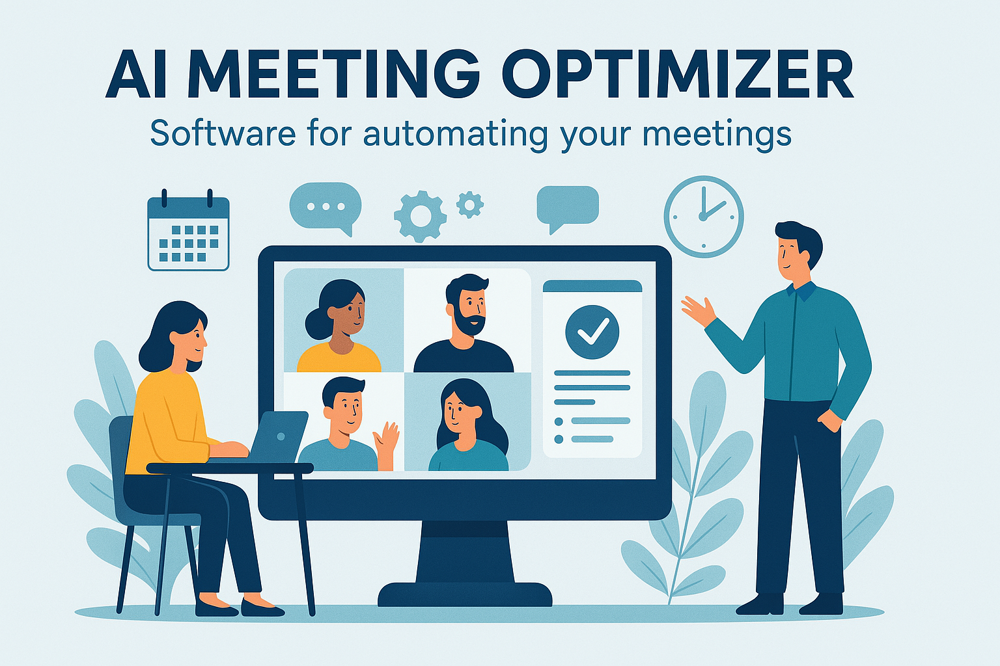

# 

## AI Meeting Optimizer

> ⚠️ The project is under active development. Many features are not yet implemented or are still in progress ⚠️

📘 **AI Meeting Optimizer** is an intelligent service that ...

## 🎓 Implemented Features

> ⚠️ The project is under active development. Many features are not yet implemented or are still in progress ⚠️

## 🧩 Notes

> ⚠️ The project is under active development. Many features are not yet implemented or are still in progress ⚠️

## 📬 Feedback

Author: [Vitaliy Bondarenko](https://github.com/VIBondarenko)  
Feel free to open issues for discussions, suggestions, or questions!
Email: [vibondarenko@gmail.com](mailto:vibondarenko@gmail.com)
